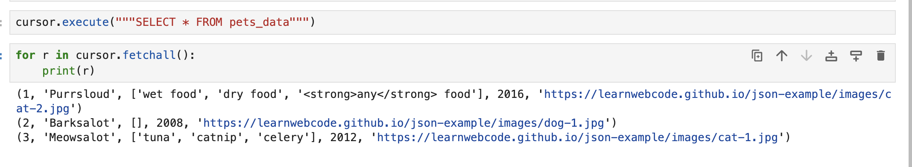
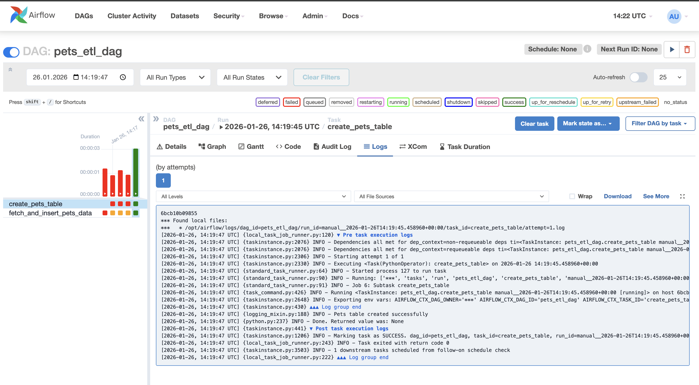
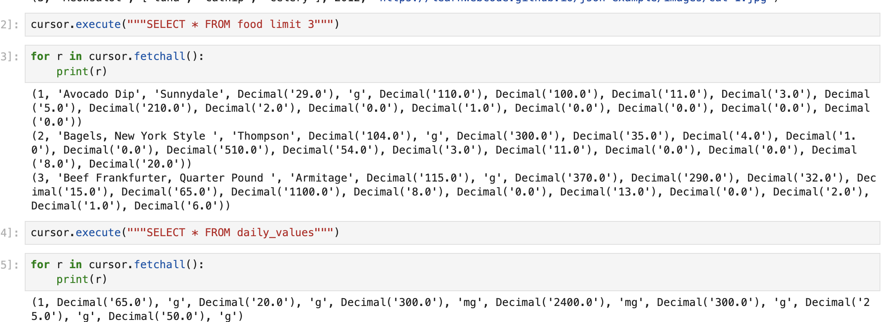

# HSE DE ETL. Задание 1

Данные по животным сохранил в таблицу
```sql
create table if not exists pets_data (
    id serial primary key,
    name varchar(255) not null,
    favFoods varchar(255)[] not null,
    birthYear smallint not null,
    photo varchar(255) not null
);
```
Запрос результата

Выпонение дага



Данные по еде сохранил в 2 таблицы
```sql
create table if not exists daily_values (
    id serial primary key,
    total_fat numeric not null,
    total_fat_units varchar(10) not null default 'g',
    saturated_fat numeric not null,
    saturated_fat_units varchar(10) not null default 'g',
    cholesterol numeric not null,
    cholesterol_units varchar(10) not null default 'mg',
    sodium numeric not null,
    sodium_units varchar(10) not null default 'mg',
    carb numeric not null,
    carb_units varchar(10) not null default 'g',
    fiber numeric not null,
    fiber_units varchar(10) not null default 'g',
    protein numeric not null,
    protein_units varchar(10) not null default 'g'
);

create table if not exists food (
    id serial primary key,
    name varchar(255) not null,
    mfr varchar(255),
    serving numeric,
    serving_units varchar(10) default 'g',
    calories_total numeric,
    calories_fat numeric,
    total_fat numeric,
    saturated_fat numeric,
    cholesterol numeric,
    sodium numeric,
    carb numeric,
    fiber numeric,
    protein numeric,
    vitamin_a numeric,
    vitamin_c numeric,
    mineral_ca numeric,
    mineral_fe numeric
);
```
Запрос результата

Выпонение дага
