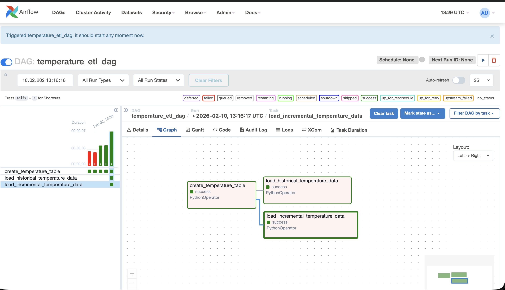

# HSE DE ETL. Задание 3

Исходные данные также как в задании 3 сохранил в таблицу
```sql
    create table if not exists temperature_readings (
        id serial primary key,
        noted_date date not null,
        temp numeric not null,
        out_in varchar(10) not null,
        device_id varchar(255)
    );
```
Отфильтрованные и агрегированные в в другую таблицу 
```sql
    create table if not exists temperature_metrics (
        id serial primary key,
        metric_type varchar(50) not null,
        noted_date date not null,
        avg_temp numeric not null,
        min_temp numeric,
        max_temp numeric,
        created_at timestamp default current_timestamp
    );
```

Таск load_historical_temperature_data удаляет все данные в таблице и записывает новые

Таск load_incremental_temperature_data, наоборот, удаляет все данные в таблице младше текущего дня - 1, затем записывает новые данные младше той же даты

Выпонение дага


Сам даг
[](./airflow/dags/temperature_etl_dag.py)