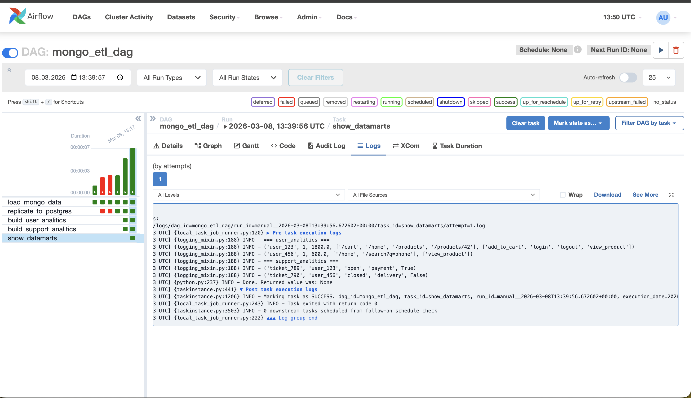

# HSE DE ETL. Итоговое задание

Итоговый даг - 

### 1. Заполнение базы mongodb

Заполнение проиходит в таске load_mongo_data, заполняются 5 таблиц:
 - UserSessions: данные пользовательских сессий
 - EventLogs: данные по событиям клинтов
 - SupportTickets: данные по обращениям в поддержку
 - UserRecomendations: данные по рекомендациям пользователей
 - ModerationQueue: данные по модерации обращений

### 2. Репликация данных в postgres

Репликация просиходит один к одному в таске replicate_to_postgres

### 3. Заполнение витрин

Заполнение происходит в тасках build_user_analitics и build_support_analitics

На выходе получаются две таблицы user_analitics и support_analitics

### 4. Вывод данных витрин в логи в таске show_datamarts

Результат работы дага 
